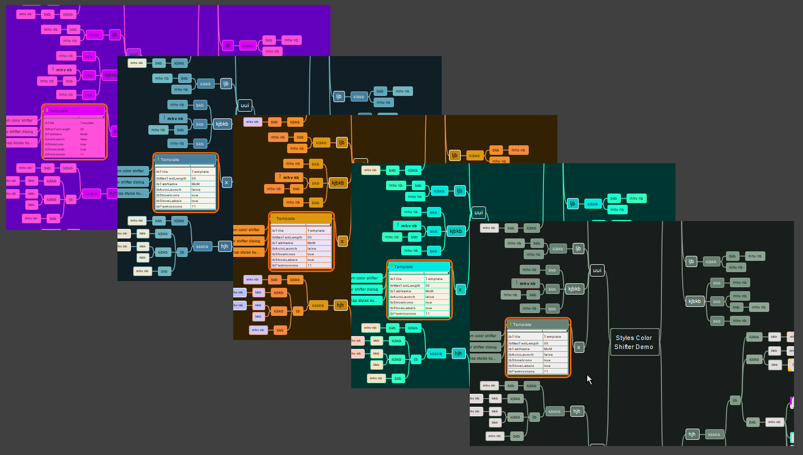
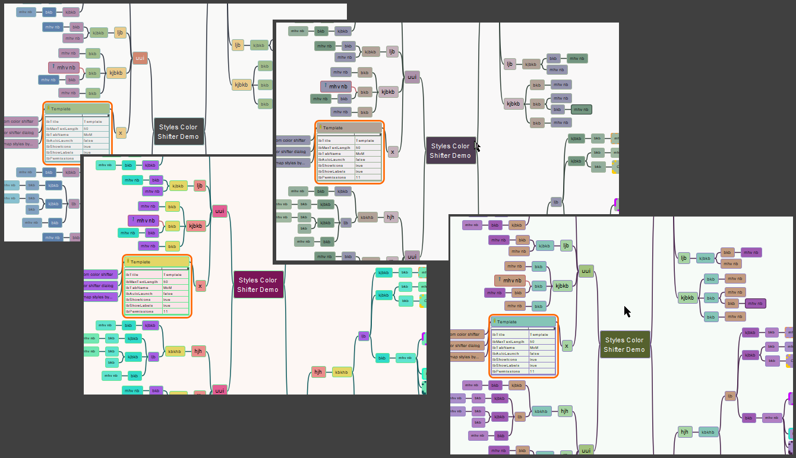
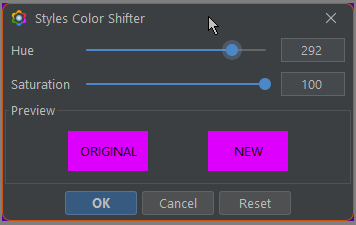

# Styles Color Shifter

This add-on allows to "shift" the colors of the template to adapt the mind map to the user's taste and/or to the style required by the mindmaps content.

-----

## 1. Status

||comment|
|----|----|
|Version|0.0.1|
|Status (1)|Working|
|Usefulness (2)|I will report after a while|
|my opinion|Interesting, funny|

<h3>1.1. Status table explanation</h3>

I added this table to give some more information about the addon, its development status and my own impression of its usefulness.

1. Status
   - Status of the project
   - Like:
      - Designing
      - Testing ideas
      - Work in progress
      - Working
      - Mature
1. Usefulness
   - This point expresses how important this tool is in the mind mapping process for me
   - Like:
      1. A must! I can't use Freeplane without it
      1. Very helpful. I use it every day
      1. Useful. It works for me when I need it
      1. Helps but is not necessary
      1. I don't use it much
      1. I don't use it

-----

## 2. Features

### 2.1. Shifting colors using the dialog

The dialog:

Sample video:

### 2.2. Random shift of colors

You can randomly shift the colors of your mind map:

Sample video:

!

----

--- No file found!! ---

----

